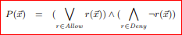
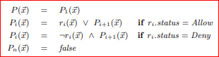

## Zen VNET Testing

This project is an exploration in leveraging probabilistic solvers to verify 
network security conditions. Specifically, we will be using the Z3 solver from 
Microsoft Research to evaluate a set of access control lists (on Azure, Network 
Security Groups).

### Background

When verifying correct network infrastructure configuration and behavior, approaches 
typically fall within the following solution types:

- **Resource Verification**
  
  Example: _Is the device configured the way is should be?_
- **Explicit flow testing (positive cases)**
  
  Example: _Can a packet flow from point A to point B?_
- **Explicit flow testing (negative cases)**
  
  Example: _Are packets blocked from flowing from point B to point C?_
- **Exploratory testing**
  
  Example: _Find all addresses/ports that violate a business rule_

Each of these approaches has distinct advantages and challenges. Following the outline 
above, we could enumerate these:

- **Resource Verification**
  
  Advantages: Relatively easy to check; Doesn’t require software installation / etc. Leverage Azure management plane API.

  Disadvantages: Only checks that configuration is present; doesn’t verify behavior.

- **Explicit flow testing (positive cases)**
  
  Advantages: Concrete answers that match behavioral specifications (e.g., VM-A can talk to VM-B). Leverage agents / Network Watcher API / etc.

  Disadvantages: May require installation of testing utilities (compromising validation/etc)
  
- **Explicit flow testing (negative cases)**
  
  Advantages: Concrete answers that match behavioral specifications (e.g., VM-A can talk to VM-B). Leverage agents / Network Watcher API / etc.

  Disadvantages: Typically harder to derive; can take longer to maintain and update.  May require installation of testing utilities (compromising validation/etc)

- **Exploratory testing**
  
  Advantages: Uncovers "What you don’t know"/unknowns that can lead to security issues.

  Disadvantages: Can be computationally expensive (IP x Ports x nodes); May require installation of testing utilities; May falsely trigger IDS/etc. systems

While the first 3 options have relatively known solutions, the goal here is to explore reducing the 
computational complexity of the last option ("Exploratory testing") to provide 
more rapid validation that no unknown beahviors are present.

### Overview

This solution is based around formulating a desired invariant as a boolean function 
expression. For example, when evaluating ACL rules in a "deny overrides" type approach, the 
following type of expressiong could be formulated:



> In this expression, P(x) represents an overall policy resule, with r(x) denoting a single rule within that policy.

Alternatively, we could also evaluate against a "first matches" type approch, in which we would 
have an approach like this following:



> In this expression, we are looking at each rule and checking to see if it a packet matches the rule. If none match, we assume the packet is blocked by the polity.

> NOTE: The above equations are from the SecGuru paper found in the references section.

### Example 

Under the `src/Rulesets` folder, there is a `DemoRulesetLoader` which sets up the following environment:

- 2 virtual networks (10.0.1.0/24 and 192.168.0.1/24)
- Traffic _within_ the 10.0.1.0/24 space is allowed
- Traffic _to_ Google DNS is allowed
- Traffic _from_ the 192.168.0.1/24 space is allowed on port 22
- Traffic _from_ a single outside IP is enabled to a few IPs on port 443
- All other _inbound_  internet (outside) traffic is blocked.

To help validate, we setup a predicate expression in Z3/Zen looking for all packets that are coming 
from sources that are _outside_ the 10.0.1.0/24 network space. This rule looks like the 
following (from `src/Solvers/Strategies.cs`):

```c#
            inboundAllowed.Invariant = (packet, result) =>
                {
                    Zen<uint> srcIp = packet.GetSrcIp();
                    return And(
                        Or( // Looking for packets _not_ coming from the VNET ..
                            And(
                                srcIp >= IPAddressUtilities.StringToUint("1.0.0.1"),
                                srcIp < IPAddressUtilities.StringToUint("10.0.1.0")
                            ),
                            And(
                                srcIp > IPAddressUtilities.StringToUint("10.0.1.255"),
                                srcIp <= IPAddressUtilities.StringToUint("223.255.255.255")
                            )
                        ), 
                        result == true // ..that are allowed by ACL policy
                    );
                };
```
We also are leveraging the "First Matches" approach discussed above, and have encoded this as follows (from `src/Acl.cs`):

```c#
        private Zen<bool> Allowed(Zen<Packet> packet, int lineNumber)
        {
            if (lineNumber >= this.Rules.Length)
            {
                return false; // Zen implicitly converts false to Zen<bool>
            }

            var line = this.Rules[lineNumber];

            // if the current line matches, then return the action, otherwise continue to the next line
            return If(line.Matches(packet), line.Permit, this.Allowed(packet, lineNumber + 1));
        }
```

Running the program in this configuration will spit out identified packet flows (up to 25 currently) 
that satisfy the above constraints (sample results below). By toggling the "Permit" flags 
against the demo set you can test how these individual rules impact these flows:

```bash
**********************************
     SMT Network Testing Demo
**********************************

2021-04-21T09:59:10.9055516-04:00 - INFO: Loading default ruleset
2021-04-21T09:59:10.9195697-04:00 - INFO: Default ruleset loaded
2021-04-21T09:59:10.9218718-04:00 - INFO: Starting model evaluation
2021-04-21T09:59:10.9219469-04:00 - INFO: Using the "Find Inbound Allowed" strategy
2021-04-21T09:59:11.2388481-04:00 - INFO: Model evaluation finished (316 msec)
2021-04-21T09:59:11.2393654-04:00 - INFO: Writing solution results

**********************************
          Summary Report
**********************************

The following solutions satisfy the "Find Inbound Allowed" strategy constraints:
(displaying a maximum of 25 results)

Source: 192.168.1.10:*          Destination: 10.0.1.192:22
Source: 192.168.1.10:*          Destination: 10.0.1.0:22
Source: 192.168.1.10:*          Destination: 10.0.1.1:22
Source: 20.60.134.228:*         Destination: 10.0.1.4:443
Source: 20.60.134.228:*         Destination: 10.0.1.8:443
Source: 20.60.134.228:*         Destination: 10.0.1.5:443
Source: 20.60.134.228:*         Destination: 10.0.1.6:443
Source: 192.168.1.10:*          Destination: 10.0.1.184:22
Source: 20.60.134.228:*         Destination: 10.0.1.7:443
Source: 192.168.1.10:*          Destination: 10.0.1.2:22
Source: 192.168.1.10:*          Destination: 10.0.1.3:22
Source: 192.168.1.10:*          Destination: 10.0.1.8:22
Source: 192.168.1.10:*          Destination: 10.0.1.188:22
Source: 192.168.1.10:*          Destination: 10.0.1.4:22
Source: 192.168.1.10:*          Destination: 10.0.1.5:22
Source: 192.168.1.10:*          Destination: 10.0.1.128:22
Source: 192.168.1.10:*          Destination: 10.0.1.6:22
Source: 192.168.1.10:*          Destination: 10.0.1.12:22
Source: 192.168.1.10:*          Destination: 10.0.1.132:22
Source: 192.168.1.10:*          Destination: 10.0.1.129:22
Source: 192.168.1.10:*          Destination: 10.0.1.13:22
Source: 192.168.1.10:*          Destination: 10.0.1.14:22
Source: 192.168.1.10:*          Destination: 10.0.1.15:22
Source: 192.168.1.10:*          Destination: 10.0.1.133:22
Source: 192.168.1.10:*          Destination: 10.0.1.7:22

2021-04-21T09:59:11.2413585-04:00 - INFO: Completed writing solution results
```

### Prior Work

There are many applications of Z3 for network verification, including on 
the Azure platform itself (see References). This example builds on these concepts 
in an effort to provide another concept that could be used to help validate network infrastructure.

### Future Work

While this is only a quick demonstration, it is lacking several features which could be used
to properly validate existing network infrastructure. These are (in no particular order):

- Building a correct graph of network connected device in order to property combine and order ACL's
- Handling network address translation that may give false results due to packets matching/not-matching.
- Additional parser (`IRulesetLoader`) implementations to digest existing network configurations.
- Testing build out

### References:

- "SecGuru: Automated Analysis and Debugging of Network Connectivity Policies", https://www.microsoft.com/en-us/research/wp-content/uploads/2016/02/secguru.pdf
- "Automated Analysis and Debugging of Network Connectivity Policies", https://www.microsoft.com/en-us/research/wp-content/uploads/2016/02/secguru.pdf
- "Checking Cloud Contracts in Microsoft Azure", https://www.microsoft.com/en-us/research/wp-content/uploads/2016/02/nbjorner-icdcit2015.pdf
- "Checking Firewall Equivalence with Z3", ​https://ahelwer.ca/post/2018-02-13-z3-firewall/